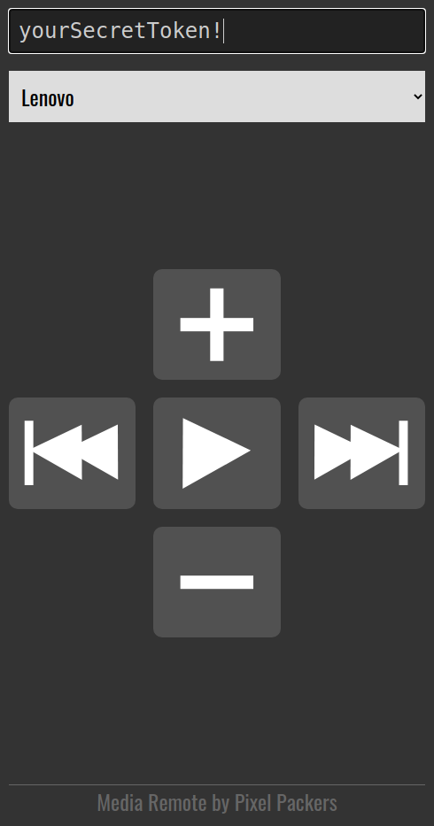

# Introduction
**Media Remote** makes it possible to send media key inputs to your PC from any device via a website. This means that you can use your smartphone as a remote control for your sound system connected to your PC. 

This implementation is independent of the media player you are using as long as your system supports media-key input.

MediaRemote consists of three parts:
+ `receiver` to react to media key inputs
+ `website` which acts as the user interface to send input
+ `server` to act as a relay to pass input coming from the website to the correct device
+ 
MediaRemote uses WebSockets as the underlying transfer technology. This makes it possible to connect your devices immediately and transport messages in realtime. As soon as a new receiver is started you will see the device listed on your website.

# Limitations / Known issues
For now the MediaRemote receiver only works on Linux because `xdotools` is only available for this platform. See [Issue #1](https://github.com/BeayemX/MediaRemote/issues/1).

MediaRemote does only send key-input to the receiver, it is not possible to know if the input has been handled. It is also not possible to receive information regarding the playing audio like artist or song title.


# Usage
## Requirements
**Python**  
The scripts are written in Python therefore it must be installed on your system. For Linux systems this should already be the case.

Additionally there are some python packages required, which can be installed with 
```
python3 -m pip install -r requirements.txt --user
```

**xdotool**  
The receiver script uses `xdotool` to send keycodes to the pc.

Depending on the linux distribution it can be installed with something along the lines of:

```
sudo apt install xdotool
```

## Start using MediaRemote
To start using MediaRemote just download this repository or use `Git` to clone it like this:
```
git clone https://github.com/BeayemX/MediaRemote.git
cd ./MediaRemote/
```


# Receiver
The receiver is your device where your music is playing and which will react to the media key inputs. You can use as many receivers as you want. They just have to use the same `token` but have a unique `device` name. 

To start listening for input you have to start it like this:

```
cd ./src/receiver/
python3 ./receiver.py
```

You can also use the provided SystemD-service-file in `/examples/` for starting MediaRemote automatically when booting.

**Configuration**

Copy (or rename) the example files to their actual paths
```
cp ./examples/receiver_config.json ./src/receiver/config.json 
```

The `token` you use in your `receiver/config.json` must be entered in the website to connect your devices.
The `device` in the config file will be used as the value in the select-field of the website.
Depending on where you host the `server.py` you may have to adjust the `uri` in the config file.


# Website
Host the `src/website/` anywhere so it exposes the website to the device you want to use as the remote. The website will have a dropdown field where all your connected devices will be listed. 
Devices will automatically populate the dropdown field as soon as they connect to the server and they will automatically be removed when they disconnect.

The website also works as a Progressive Web App.

When accessing the url via a browser it should look like this:




**Configuration**

Copy (or rename) the example files to their actual paths
```
cp ./examples/website_config.js ./src/website/scripts/config.js 
```

Depending on where you are running the `server.py` you may have to adjust the `URI` in `src/website/scripts/config.js`.


# Server
The server serves as a relay server. Its only purpose is to register receivers and send inputs to the correct device.
One server can be used to route multiple receivers. It must be available on an address that the receiver and website can connect to.

Start the server like this: 
```
cd ./src/server/
python3 ./server.py
```

**Configuration**

Copy (or rename) the example files to their actual paths
```
cp ./examples/server_config.json ./src/server/config.json 
```

The server should run just fine with the default configuration. But if there is a need to define a specific network address or another port, this is possible in `src/server/config.json`. 
